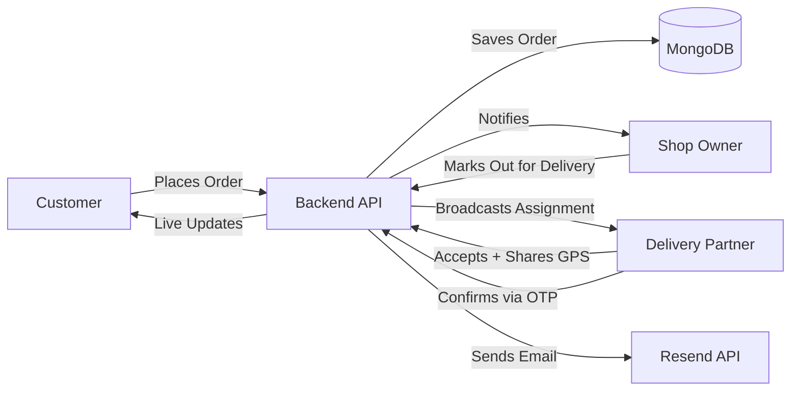

<div align="center">


[](https://vingo-sage.vercel.app)

[](https://react.dev)
[](https://vitejs.dev)
[](https://nodejs.org)
[](https://expressjs.com)
[](https://www.mongodb.com)
[](https://socket.io)
[](https://tailwindcss.com)
[](https://razorpay.com)

</div>

<br/>

## 📖 About

**Vingo** is a full-stack, real-time food delivery platform built on the MERN stack. It brings together three distinct user roles — **customers**, **shop owners**, and **delivery partners** — in one connected ecosystem, with live order tracking, instant Socket.io notifications, and secure OTP-verified handoffs at every step of the journey, from cart to doorstep.

<br/>

## ✨ Features

<table>
<tr>
<td width="33%" valign="top">

### 🛍️ Customer
- Browse shops & items by city/location
- Smart cart & multi-shop checkout
- Interactive map-based address picker
- Pay via COD or Razorpay (UPI/Card)
- Live order tracking on map
- In-app chat with delivery partner
- OTP-verified delivery confirmation
- Full order history & status updates

</td>
<td width="33%" valign="top">

### 🏪 Shop Owner
- Create & manage shop profile
- Add / edit / remove menu items
- Image uploads via Cloudinary
- Real-time new order alerts
- Update order status live
  (preparing → out for delivery → delivered)
- Earnings & order statistics dashboard

</td>
<td width="33%" valign="top">

### 🛵 Delivery Partner
- Real-time nearby delivery assignments
- Accept available orders
- Live GPS broadcasting during delivery
- OTP verification to confirm delivery
- Daily earnings dashboard
- Delivery stats with charts

</td>
</tr>
</table>

### Platform-Wide

| Capability | Details |
|---|---|
| **Role-based Auth** | Customer / Owner / Delivery Boy, with protected routes per role |
| **Flexible Sign-in** | Email + password, plus Google OAuth |
| **OTP Password Reset** | Secure email-based account recovery |
| **Persistent Sessions** | Secure, HTTP-only, cross-site cookies (JWT-based) |
| **Real-Time Everything** | Orders, assignments, GPS, and chat — all live via Socket.io |
| **Responsive UI** | Smooth, animated experience across desktop and mobile |

<br/>

## 🛠️ Tech Stack

| Layer | Technologies |
|:---|:---|
| **Frontend** | React · Vite · Redux Toolkit · React Router DOM · Tailwind CSS · Framer Motion · React Leaflet (OpenStreetMap) · Recharts · Socket.io Client · Axios |
| **Backend** | Node.js · Express · MongoDB · Mongoose · Socket.io · JWT · bcryptjs |
| **Third-Party Services** | Cloudinary (images) · Razorpay (payments) · Resend (email/OTP) · Geoapify (geocoding) · Firebase (Google Auth) |
| **Deployment** | Vercel (frontend) · Render (backend) · MongoDB Atlas (database) |

<br/>

## 📁 Project Structure

```
vingo/
├── frontend/
│   ├── src/
│   │   ├── components/      # Nav, Footer, Dashboards, Cards, Chat, Tracking
│   │   ├── pages/            # SignIn, SignUp, Home, CheckOut, MyOrders...
│   │   ├── redux/             # user slice, map slice
│   │   ├── hooks/             # useGetCurrentUser, useGetCity, useGetMyShop...
│   │   └── App.jsx
│   └── package.json
│
└── backend/
    ├── controllers/         # auth, order, shop, item, user
    ├── models/                # Mongoose schemas
    ├── routes/                # Express routers
    ├── utils/                  # mail, token, cloudinary helpers
    ├── config/                # DB connection
    ├── socket.js              # Real-time event handlers
    ├── index.js                # App entry point
    └── package.json
```

<br/>

## 🚀 Getting Started Locally

### Prerequisites
- Node.js v18+
- MongoDB Atlas account (or local MongoDB instance)
- API keys/accounts for: Cloudinary, Razorpay, Resend, Geoapify, Firebase

### 1. Clone the repository
```bash
git clone https://github.com/your-username/vingo.git
cd vingo
```

### 2. Backend Setup
```bash
cd backend
npm install
```

Create a `.env` file in `backend/`:
```env
PORT=8000
MONGODB_URL=your_mongodb_connection_string
JWT_SECRET=your_jwt_secret
RESEND_API_KEY=your_resend_api_key
CLOUDINARY_CLOUD_NAME=your_cloud_name
CLOUDINARY_API_KEY=your_cloudinary_key
CLOUDINARY_API_SECRET=your_cloudinary_secret
RAZORPAY_KEY_ID=your_razorpay_key_id
RAZORPAY_KEY_SECRET=your_razorpay_secret
```

```bash
npm run dev
```

### 3. Frontend Setup
```bash
cd frontend
npm install
```

Create a `.env` file in `frontend/`:
```env
VITE_API_URL=http://localhost:8000
VITE_GEOAPIKEY=your_geoapify_key
VITE_RAZORPAY_KEY_ID=your_razorpay_key_id
```

```bash
npm run dev
```

The app will be available at `http://localhost:5173`.

<br/>

## 🔑 Authentication Roles

When signing up, users select one of three roles:

| Role value (stored in DB) | Who | Access |
|---|---|---|
| `user` | Customer | Browses shops, places orders, tracks deliveries |
| `owner` | Shop Owner | Manages menu, accepts/updates incoming orders |
| `deliveryBoy` | Delivery Partner | Accepts and completes deliveries |

> **Note:** Role values are case-sensitive (`deliveryBoy`, not `DeliveryBoy`) and must match exactly between the frontend and the backend's Mongoose schema enum.

<br/>

## 📡 Real-Time Events (Socket.io)

| Event | Direction | Description |
|---|---|---|
| `newOrder` | Server → Owner | Notifies shop owner of a new incoming order |
| `newAssignment` | Server → Delivery Partner | Notifies nearby delivery partners of an available delivery |
| `updateLocation` | Delivery Partner → Server | Broadcasts the delivery partner's live GPS position |
| `update-status` | Server → Customer | Pushes order status changes to the customer |

<br/>

## 🗺️ Order Flow



<br/>

## 🧭 Roadmap

- [ ] Push notifications for order updates
- [ ] Ratings & reviews for shops and delivery partners
- [ ] Multi-language support
- [ ] Admin panel for platform-wide analytics
- [ ] Scheduled/pre-orders

<br/>

## 📄 License

This project is built for educational and personal portfolio purposes.

<br/>

<div align="center">

**Author:** Biswajit Pattanaik

Made with ❤️ in India

</div>
