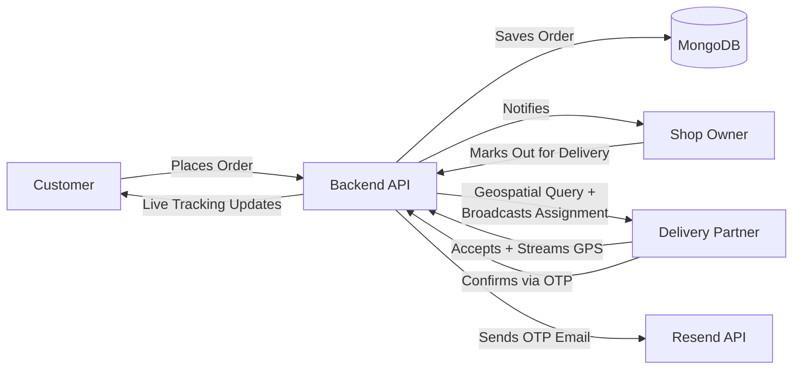

<div align="center">


[](https://vingo-sage.vercel.app)

[](https://react.dev)
[](https://vitejs.dev)
[](https://nodejs.org)
[](https://expressjs.com)
[](https://www.mongodb.com)
[](https://socket.io)
[](https://tailwindcss.com)
[](https://razorpay.com)

</div>

<br/>

## 📖 About

**Vingo** is a full-stack, real-time food delivery platform built on the MERN stack. It brings together three distinct user roles — **customers**, **shop owners**, and **delivery partners** — in one connected ecosystem.

The core idea behind Vingo is that food delivery is fundamentally a *coordination problem*: a customer needs to know where their food is, a shop owner needs to know when a new order arrives, and a delivery partner needs to know which orders are nearby and available. Vingo solves this with a Socket.io backbone that pushes updates to every relevant party the instant something changes — no polling, no refreshing, no waiting.

On top of that real-time layer sits a complete commerce flow: browsing shops by city, building a cart across multiple shops, checking out with either cash-on-delivery or online payment via Razorpay, and tracking the order live on a map until an OTP confirms it has actually arrived.

<br/>

## ✨ Features

### 🛍️ Customer Experience

- **Location-aware browsing** — shops and menu items are filtered by the customer's current city, detected via geolocation or manual address entry
- **Multi-shop cart** — add items from different shops in a single session; the backend automatically splits the order by shop when it's placed
- **Interactive checkout map** — drag a pin or search an address (powered by Geoapify) to set the exact delivery location, with reverse-geocoding to show a human-readable address
- **Two payment paths** — Cash on Delivery, or online payment via Razorpay (UPI, credit, debit card)
- **Live delivery tracking** — once a delivery partner is assigned, the customer sees their real-time position on a map, with live ETA and distance
- **In-app chat** — direct messaging with the assigned delivery partner during an active delivery
- **OTP-secured handoff** — the order is only marked "delivered" once the customer shares a one-time code with the delivery partner, preventing premature or fraudulent delivery confirmations
- **Order history** — a full list of past orders with item breakdowns, totals, and statuses

### 🏪 Shop Owner Experience

- **Shop profile management** — create and edit shop details, including a shop image hosted on Cloudinary
- **Menu management** — add, edit, and delete individual food items, each with its own image, price, and category
- **Real-time order intake** — new orders appear instantly via a Socket.io `newOrder` event, with no need to refresh the dashboard
- **Order lifecycle control** — move an order through its stages (e.g. preparing → out for delivery → delivered); marking an order "out for delivery" automatically triggers the delivery-assignment search
- **Earnings dashboard** — aggregated daily/period earnings and order counts, visualized with charts

### 🛵 Delivery Partner Experience

- **Geolocation-based assignment matching** — when a shop marks an order "out for delivery," the backend runs a MongoDB geospatial query (`$near`) to find delivery partners within a set radius who aren't already busy with another delivery
- **Live assignment broadcast** — all eligible nearby delivery partners receive the assignment in real time and can accept it on a first-come basis
- **Continuous GPS tracking** — once an order is accepted, the delivery partner's location is tracked via the browser's Geolocation API and streamed to the backend, which relays it to the customer's tracking map
- **OTP delivery confirmation** — generates and emails a one-time code to the customer, which the delivery partner must enter to mark the order complete
- **Performance dashboard** — daily delivery count and earnings, broken down by hour in a bar chart

### 🌐 Platform-Wide

| Capability | Details |
|---|---|
| **Role-based Auth** | Three roles (`user`, `owner`, `deliveryBoy`) with route-level access control on both frontend and backend |
| **Flexible Sign-in** | Email + password (bcrypt-hashed), or Google OAuth via Firebase |
| **OTP Password Reset** | Time-limited, single-use OTP sent by email to reset a forgotten password |
| **Persistent Sessions** | JWT stored in a secure, `httpOnly`, cross-site cookie (`sameSite: none`, `secure: true`) so sessions survive refreshes and work across the Vercel/Render domain split |
| **Real-Time Everything** | Orders, delivery assignments, GPS positions, and chat messages are all pushed live via Socket.io — not polled |
| **Responsive, Animated UI** | Built with Tailwind CSS and Framer Motion for smooth transitions across devices |

<br/>

## 🛠️ Tech Stack

| Layer | Technologies | Why |
|:---|:---|:---|
| **Frontend** | React · Vite · Redux Toolkit · React Router DOM · Tailwind CSS · Framer Motion · React Leaflet (OpenStreetMap) · Recharts · Socket.io Client · Axios | Fast dev/build cycle (Vite), predictable global state (Redux Toolkit), free open-source maps (Leaflet + OSM) |
| **Backend** | Node.js · Express · MongoDB · Mongoose · Socket.io · JWT · bcryptjs | Flexible document model for nested order/shop data, native geospatial queries for delivery matching |
| **Third-Party Services** | Cloudinary (images) · Razorpay (payments) · Resend (email/OTP) · Geoapify (geocoding) · Firebase (Google Auth) | Offload storage, payments, email, and geocoding to specialized providers rather than building them in-house |
| **Deployment** | Vercel (frontend) · Render (backend) · MongoDB Atlas (database) | Free-tier-friendly hosting split across specialized platforms |

<br/>

## 📁 Project Structure

```
vingo/
├── frontend/
│   ├── src/
│   │   ├── components/      # Nav, Footer, Dashboards (User/Owner/DeliveryBoy),
│   │   │                    # Cards, DeliveryChat, DeliveryBoyTracking
│   │   ├── pages/            # SignIn, SignUp, ForgotPassword, Home, CheckOut,
│   │   │                    # CartPage, MyOrders, TrackOrderPage, Shop, etc.
│   │   ├── redux/             # user slice, map slice
│   │   ├── hooks/             # useGetCurrentUser, useGetCity, useGetMyShop,
│   │   │                    # useGetShopByCity, useGetItemsByCity, useGetMyOrders,
│   │   │                    # useUpdateLocation
│   │   ├── socketManager.js  # Singleton Socket.io client instance
│   │   └── App.jsx           # Route definitions & role-based redirects
│   └── package.json
│
└── backend/
    ├── controllers/         # auth, order, shop, item, user controllers
    ├── models/                # User, Shop, Item, Order, DeliveryAssignment schemas
    ├── routes/                # Express routers per resource
    ├── utils/                  # mail.js (Resend), token.js (JWT), cloudinary.js
    ├── config/                # db.js — MongoDB connection
    ├── socket.js              # Socket.io connection & event handlers
    ├── index.js                # Express app entry point
    └── package.json
```

<br/>

## 🚀 Getting Started Locally

### Prerequisites

- **Node.js** v18 or higher
- A **MongoDB** database — either a free [MongoDB Atlas](https://www.mongodb.com/atlas) cluster or a local instance
- Accounts/API keys for:
  - [Cloudinary](https://cloudinary.com) — image hosting
  - [Razorpay](https://razorpay.com) — payment processing (test mode keys work fine for development)
  - [Resend](https://resend.com) — transactional email for OTPs *(see note on email delivery below)*
  - [Geoapify](https://www.geoapify.com) — geocoding for the address picker
  - [Firebase](https://firebase.google.com) — Google OAuth sign-in

### 1. Clone the repository

```bash
git clone https://github.com/your-username/vingo.git
cd vingo
```

### 2. Backend Setup

```bash
cd backend
npm install
```

Create a `.env` file in `backend/`:

```env
PORT=8000
MONGODB_URL=your_mongodb_connection_string
JWT_SECRET=your_jwt_secret
RESEND_API_KEY=your_resend_api_key
CLOUDINARY_CLOUD_NAME=your_cloud_name
CLOUDINARY_API_KEY=your_cloudinary_key
CLOUDINARY_API_SECRET=your_cloudinary_secret
RAZORPAY_KEY_ID=your_razorpay_key_id
RAZORPAY_KEY_SECRET=your_razorpay_secret
```

Run the dev server (auto-restarts on file changes via `nodemon`):

```bash
npm run dev
```

You should see `db connected` and `server started at 8000` in the terminal.

### 3. Frontend Setup

```bash
cd frontend
npm install
```

Create a `.env` file in `frontend/`:

```env
VITE_API_URL=http://localhost:8000
VITE_GEOAPIKEY=your_geoapify_key
VITE_RAZORPAY_KEY_ID=your_razorpay_key_id
```

Run it:

```bash
npm run dev
```

The app will be available at **`http://localhost:5173`**.

<br/>

## 📧 A note on transactional email

Vingo uses [Resend](https://resend.com) to send OTP emails for password resets and delivery confirmation. On Resend's free tier, **emails can only be delivered to the address associated with your Resend account** until you verify a sending domain. For local development and testing, this is fine — but before sending OTPs to real, arbitrary customer email addresses in production, you'll need to either:

1. Verify a domain you own in Resend's dashboard, or
2. Switch to a provider without this restriction on free tier (e.g. Brevo)

This is a deliberate anti-spam safeguard on Resend's end, not a bug in this codebase.

> ⚠️ Also worth knowing: **Gmail SMTP (via `nodemailer`) does not work on Render's free tier** — outbound connections on SMTP ports (465/587) are blocked to prevent spam abuse, which is why this project uses an HTTPS-based email API instead.

<br/>

## 🔑 Authentication & Roles

When signing up, users select one of three roles, stored exactly as shown below:

| Role value (stored in DB) | Who | Access |
|---|---|---|
| `user` | Customer | Browses shops, places orders, tracks deliveries |
| `owner` | Shop Owner | Manages menu, accepts/updates incoming orders |
| `deliveryBoy` | Delivery Partner | Accepts and completes deliveries |

> **Note:** Role values are case-sensitive and must match exactly between the frontend (signup form, dashboard routing) and the backend's Mongoose schema `enum`. A mismatch here (e.g. `DeliveryBoy` vs `deliveryBoy`) fails silently in some places and loudly in others — it's worth double-checking any new role-based conditional against the schema directly.

Sessions are managed via a JWT stored in an `httpOnly` cookie with `sameSite: "none"` and `secure: true`, since the frontend (Vercel) and backend (Render) live on different domains — a same-site cookie policy would silently fail to persist the session across that split.

<br/>

## 📡 Real-Time Events (Socket.io)

| Event | Direction | Description |
|---|---|---|
| `identity` | Client → Server | Registers a connected socket against a logged-in user's ID |
| `newOrder` | Server → Owner | Notifies a shop owner of a new incoming order |
| `newAssignment` | Server → Delivery Partner | Notifies nearby, available delivery partners of a new delivery opportunity |
| `updateLocation` | Delivery Partner → Server | Streams the delivery partner's live GPS coordinates |
| `update-status` | Server → Customer | Pushes order status changes (preparing, out for delivery, delivered) |

<br/>

## 🗺️ Order Flow



<br/>

## 🔒 Security Notes

- Passwords are hashed with **bcrypt** before storage — plaintext passwords are never persisted
- JWTs are stored in `httpOnly` cookies, inaccessible to client-side JavaScript, reducing XSS-based token theft risk
- OTPs (for both password reset and delivery confirmation) are time-limited (5 minutes) and single-use
- CORS is explicitly restricted to a defined allowlist of trusted origins, not a wildcard
- Environment variables hold all secrets (DB credentials, API keys, JWT secret) — none are committed to the repository

<br/>

## 🧭 Roadmap

- [ ] Push notifications for order updates
- [ ] Ratings & reviews for shops and delivery partners
- [ ] Multi-language support
- [ ] Admin panel for platform-wide analytics
- [ ] Scheduled/pre-orders
- [ ] Domain-verified email sending for production-ready OTP delivery to any address

<br/>

## 📄 License

This project is built for educational and personal portfolio purposes.

<br/>

## 🙏 Acknowledgments

- [OpenStreetMap](https://www.openstreetmap.org) contributors, for free map tile data
- [Geoapify](https://www.geoapify.com), for geocoding services
- [Razorpay](https://razorpay.com), for payment infrastructure
- [Resend](https://resend.com), for transactional email delivery

<br/>

<div align="center">

**Author:** Biswajit Pattanaik

Made with ❤️ in India

</div>
